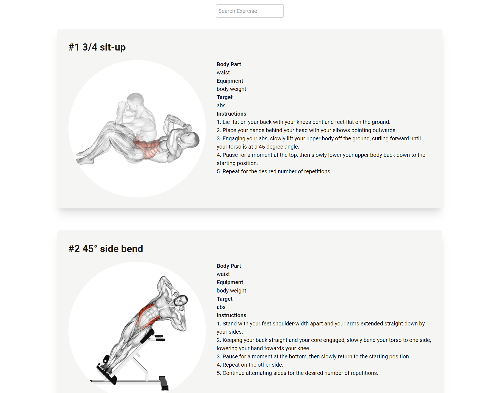

# Module#5 React Day #9 Classwork: Physical Health WebApp


## Hosted Version of the Project:
[m5react-day-9-classwork-physical-health-webapp](https://m5react-day-9-classwork-physical-health-webapp.vercel.app/)

## Objectives
+ Developed a Physical Health Website using React.
+ Utilized the useEffect hook to fetch data from an API.
+ Implemented a search bar using the useState hook for user-friendly data retrieval.


## How to install and run in yours local machine
```bash
npm install
npm run start
```

## Tech. Stack Used:
+ [React](https://react.dev/)
+ [TailwindCSS](https://tailwindcss.com/)
+ [Google Fonts](https://fonts.google.com/)
+ [Font Awesome](https://fontawesome.com/icons/)

## Author
[Abhishek kumar](https://www.linkedin.com/in/alex21c/), ([Geekster](https://geekster.in/) MERN Stack FS-14 Batch)


